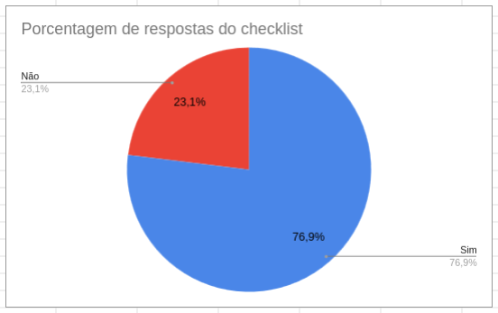

# __Verificação do Cronograma__

## __Introdução__

A inspeção formal do cronograma do projeto é uma prática essencial para assegurar a qualidade e a consistência do planejamento, identificando possíveis ajustes e corrigindo problemas antecipadamente. Este processo permite que a equipe valide as etapas e prazos estabelecidos, minimizando riscos e otimizando o gerenciamento das atividades.

## __Metodologia__

A técnica de inspeção utilizada será a Inspeção por lista de verificação, que é uma abordagem prática e estruturada na verificação de cronogramas e outros artefatos. Nesta técnica, desenvolvemos uma lista de critérios baseados em princípios de Interação Humano-Computador (IHC), como clareza, usabilidade, consistência e visibilidade. 

Cada item da lista de verificação aborda uma área específica do cronograma para garantir que todas as informações sejam acessíveis e que o layout e os conteúdos estejam organizados. Durante a inspeção, cada critério é avaliado e marcado como atendido ou necessitando de ajustes, o que permite documentar claramente as áreas de melhoria e aplicar ações corretivas com precisão.

| Critério                              | ID      | Perguntas de Verificação                                                               | Avaliação     | Observação      |
|---------------------------------------|---------|----------------------------------------------------------------------------------------|---------------|-----------------|
| **Completude**                        | 01      | O cronograma inclui todas as etapas essenciais para a primeira entrega?                | Sim           |                 |
|                                       | 02      | Todos os marcos e entregáveis estão listados?                                          | Sim           |                 |
| **Clareza**                           | 03      | As descrições das atividades são claras e compreensíveis?                              | Não           | Falta inserir as descrições das atividades.|
|                                       | 04      | As responsabilidades de cada atividade estão bem definidas?                            | Sim           |                 |
| **Precisão Temporal**                 | 05      | Os prazos são realistas e viáveis dentro do contexto do projeto?                       | Sim           |                 |
|                                       | 06      | O cronograma possui datas de início e fim bem definidas para cada atividade?           | Sim           |                 |
| **Distribuição de Carga de Trabalho** | 07      | As atividades estão distribuídas de forma equilibrada entre os participantes?          | Sim           |                 |
| **Usabilidade e Navegação**           | 08      | O layout do cronograma é fácil de entender e visualizar?                               | Sim           |                 |
|                                       | 09      | As informações são dispostas de forma lógica e intuitiva?                              | Sim           |                 |
| **Visibilidade do Status**            | 10      | O cronograma permite que a equipe visualize facilmente o andamento do projeto?         | Sim           |                 |
|                                       | 11      | Mudanças ou atualizações no cronograma são visíveis de forma clara?                    | Não           | Não foi inserido o cronograma executado a fim de observer essas alterações|
|**Conformidade com o padrão**          | 12      | O artefato possui uma bibliografia/referência bibliográfica?                           | Não |                 |                        
|                                       | 13      | O cronograma foi elaborado em tabelas?                                                 | Sim           |                 |

_Autor: [Luiza Maluf](https://github.com/LuizaMaluf)_

## __Problemas encontrados__

- Falta a descrição das atividades do cronograma.
- Não exite uma comparação entre o que foi feito realmente e o que foi planejado ser feito.
- Não há introdução, bibliografia ou referência bibliográfica na página de cronograma.

## __Soluções propostas__

__ID 03:__ Inserir um campo na tabela com uma breve descrição da atividade.

__ID 11:__ Inserir ao final do cronograma da etapa um cronograma executado com a finalidade de deixar explícito as execuções do grupo.

__ID 12:__ Inserir as referências.

## __Acompanhamento__

A figura a seguir apresenta um gráfico com o percentual das respostas da lista de verificação.

_Autor: [Luiza Maluf](https://github.com/LuizaMaluf)_

## __Correção__

Como proposto por Fagan, os integrantes do grupo que foram responsáveis pela produção do artefato que devem fazer as devidas correções propostas pela verificação.

Dessa forma, após a correção, o autor dessa verificação irá revisar se as correçõe s foram feitas da forma correta. 

| Data da Correção | Descrição | Responsável(eis) | Revisor(es) | Status |
|------------------|-----------|------------------|-------------|--------|
| 11/11/2024       | Correções sugeridas | [Márcio Henrique](https://github.com/DeM4rcio) | [Luiza Maluf](https://github.com/LuizaMaluf) | **ok** |

## __Bibliografia__

HENRIQUE, Márcio. Cronograma. Repositório do Grupo 08 da disciplina de Interação Humano Computador da Universidade de Brasília, 2024. Disponível em : <https://interacao-humano-computador.github.io/2024.2-Grupo08/planejamento/cronograma/>. Acesso em: 10/11/2024.

## __Referências Bibliográficas__

_BARBOSA, S. D. J.; SILVA, B. S. Interação Humano-Computador. Rio de Janeiro: Elsevier, 2011._

---
## __Histórico de versão__

| Versão |    Data    |      Descrição      |             Autor(es)                        |
|--------|------------|---------------------|----------------------------------------------|
| `1.0`  | 04/11/2024 | Criação do página | [Luiza Maluf](https://github.com/LuizaMaluf)   |
| `1.1`  | 10/11/2024 | Verificação do cronograma| [Luiza Maluf](https://github.com/LuizaMaluf)   |