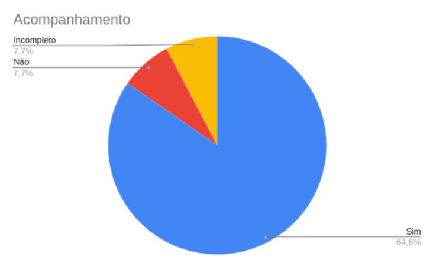

# __Verificação das Metas de Usabilidade__

## __Introdução__

Este documento apresenta a verificação de software com foco nas metas de usabilidade definidas para o Portal DETRAN-DF.

## __Objetivo__

O objetivo desse artefato é avaliar a conformidade do portal com os critérios de eficácia, eficiência, segurança, facilidade de aprendizado, facilidade de recordação e satisfação.

## __Metodologia__

A metodologia adotada para a realização desta verificação consiste na aplicação de uma checklist estruturada, composta por um conjunto de perguntas que abrangem tanto os aspectos formais do documento quanto o seu conteúdo técnico. As respostas às perguntas serão classificadas de acordo com a seguinte escala: Sim, Não, Incompleto ou Não se aplica. Além disso, será reservado um espaço para que o avaliador registre observações adicionais.

## __Cronograma e Participantes__

A integrante do grupo [Luiza Maluf](https://github.com/LuizaMaluf) será responsável por realizar a verificação. Já, o integrante do grupo [Kaio Enzo](https://github.com/kaioenzo) realizará a correção do artefato após a verificação. A tabela 1 apresenta os participantes da verificação.

**Tabela 1** - Participantes da Verificação.

|                  Participante                  |   Papel   |
| :--------------------------------------------: | :-------: |
| [Luiza Maluf](https://github.com/LuizaMaluf) | Avaliador |
|  [Kaio Enzo](https://github.com/kaioenzo)   |  Revisora  |

_Autor: [Luiza Maluf](https://github.com/LuizaMaluf), 2024_

## __Lista de Verificação__

|  ID  | Descrição      | Avaliação  |                Observações                |
| :--: | -------------- | :--------: | :---------------------------------------: |
|      | **Padronização**  |
|  1   | O artefato possui introdução?                         |    Sim     |                     -                     |
|  2   | O artefato possui uma bibliografia/referência bibliográfica?       |    Sim     |                     -                     |
|  3   | O artefato possui um histórico de versões com o id e descrição das versões, data, autores e revisores? |    Incompleto     |                    Falta atrivuir revisores                    |
|  4   | Todas as tabelas e imagens são chamadas no texto, possuem legendas e fontes?                           |    Sim     |                     -                     |
|  5   | Todos os textos estão na norma padrão?                                                                 |    Sim     |                     -                     |
|      | **Metas de Usabilidade**               |            |                                           |
|  6   | São apresentados quais fatores de qualidade de uso serão priorizados no projeto?    | Sim | |
| 7 | A razão da seleção das metas de usabilidade? | Sim|  \
| 8 | As metas foram definidas através do perfil de usuário? | Sim | |
| 9 | Foram definidas as usabilidades em 6 metas? | Sim |  |
| 10 | O artefato descreve o contexto de uso do sistema (plataformas e dispositivos)? | Sim | |
| 11 | As metas incluem métricas para avaliação objetiva (ex: tempo, cliques, taxa de sucesso)? | Sim | |
| 12 | As metas consideram segurança (ex: proteção de dados, prevenção de erros)? | Sim | |
| 14 | O texto aborda diferentes níveis de experiência dos usuários? | Não | Não menciona níveis como iniciantes ou avançados explicitamente |

## __Problemas Encontrados__

### __ID 3: O artefato possui um histórico de versões com o id e descrição das versões, data, autores e revisores?__

O artefato não possui o campo revisores preenchido.

### __ID 14: O texto aborda diferentes níveis de experiência dos usuários?__

As metas de usabilidade não menciona níveis como iniciantes ou avançados explicitamente.

## __Sugestão de Correção__

- Adicionar os revisores na tabela do histórico de versões;

- Tratar níveis de usuários diferentes.

## __Acompanhamento__

Na figura 1, é apresentado um gráfico como o percentual de respostas __"Sim", "Não", "Incompleto"__, obtidas atraves da lista de verificação.

__Figura 1__ - Gráfico do resultado da verificação.

_Autor: [Luiza Maluf](https://github.com/LuizaMaluf)_

## __Correção__

Como proposto por Fagan, os integrantes do grupo que foram responsáveis pela produção do artefato que devem fazer as devidas correções propostas pela verificação.

Dessa forma, após a correção, o autor dessa verificação irá revisar se as correçõe s foram feitas da forma correta. 

| Data da Correção | Descrição | Responsável(eis) | Revisor(es) | Status |
|------------------|-----------|------------------|-------------|--------|
| 21/12/2024       | Correções sugeridas | [Kaio Enzo](https://github.com/kaioenzo) | [Luiza Maluf](https://github.com/LuizaMaluf) |  |

## __Referências Bibliográficas__

_BARBOSA, S. D. J.; SILVA, B. S. Interação Humano-Computador. Rio de Janeiro: Elsevier, 2011._

---
## __Histórico de versão__

| Versão |    Data    |      Descrição      |             Autor(es)                        | Revisor |
|--------|------------|---------------------|----------------------------------------------|-----|
| `1.0`  | 03/12/2024 | Verificação das metas de usabilidade | [Luiza Maluf](https://github.com/LuizaMaluf)   | [Kaio Enzo](https://github.com/kaioenzo) |
