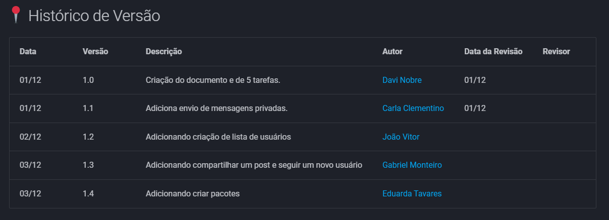
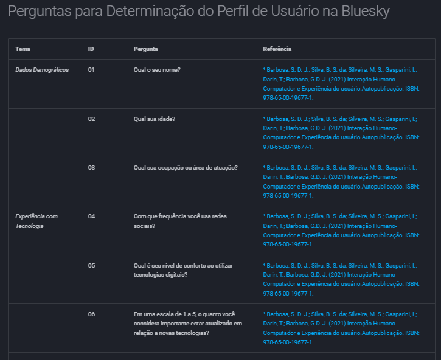

## **Introdução**

Este artefato consiste em uma verificação por meio da inspeção do material produzido pelo Grupo 01. O Grupo 08 será responsável por realizar a inspeção do artefato do Grupo 01.

## **Objetivo**

O principal objetivo dessa inspeção é identificar inconsistências, erros e pontos de melhoria no artefato produzido. Espera-se que a inspeção seja realizada de forma crítica e construtiva, contribuindo assim para a qualidade do artefato.

## **Metodologia**

A metodologia escolhida foi feita com base na idea de Fagan na IBM em 1976, que propõe a inspeção de software. A inspeção de software é uma técnica de verificação de artefatos que tem como objetivo identificar defeitos nos artefatos. A lista de verificações foi elaborada com base no Plano de Ensino da disciplina.

## **Participantes**
Os participantes da inspeção realizada são:

- [Kaio Enzo](https://github.com/kaioenzo) 

## **Lista de verificação**

### **Desenvolvimento do Projeto**

Tabela 1: Lista de Verificação

| Itens de Verificação | Resposta | Versão, Data e Hora da avaliação | Observação | 
| :---- | :---- | :---- | :---- |
| O histórico de versão padronizado? | **Sim** | versão: `1.0`\- 04/12/2024 às 21:55 | - |
| O(s) autor(es) e o(s) revisor(es) para cada artefato? | **SIM** | versão: `1.0`\- 04/12/2024 às 22:59 |    O revisores estão ausentes. |
| Referências bibliográficas e/ou bibliografia em todos os artefatos? | **SIM** | versão: `1.0`\- 04/12/2024 às 23:00 |
| As tabelas e imagens possuem legenda e fonte e elas são chamadas dentro dos textos? | **Incompleto** | versão: `1.0`\- 04/12/2024 às 23:02 |    A legenda da tabela está ausente na tela de [perfil do usuário.](https://interacao-humano-computador.github.io/2024.2-Grupo01/AnaliseRequisitos/PerfilUser/) | 
| Um texto fazendo uma introdução dos artefatos? | **SIM** | versão: `1.0`\- 04/12/2024 às 23:06 | |
| O cronograma executado com quem realizou cada artefato/atividade com as datas de início e fim da construção/realização do artefato/atividade. | **Sim** | versão: `2.0`\- 04/12/2024 às 23:07 | |
| Ata(s) da(s) reuniões (com data, horário de início e do final, participantes, objetivo, atividades definidas etc) | **SIM** | versão: `1.0`\- 13/11/2024 às 21:07 | |
| A gravação da reunião do grupo. | **Sim** |  | |
| Vídeo de apresentação na categoria “não listado” no youtube? | **Sim** | versão: `1.0`\- 04/12/2024 às 23:09 | |

*Fonte: Adaptado de [Plano de Ensino da disciplina](../../../../assets/documentos/Plano_de_Ensino.pdf)*

### Perfil do usuário, Aspectos Éticos de Pesquisas Envolvendo Pessoas e Análise de tarefas

Tabela 2: Lista de Verificação

| Itens de Verificação | Resposta | Versão, Data e Hora da avaliação | Observação | 
| :---- | :---- | :---- | :---- |
| O perfil do usuário? | **Sim** | versão: `1.0`\- 04/12/2024 às 23:15 | |
| O perfil do usuário possui os atributos de um perfil. | **Sim** | versão: `1.0`\- 04/12/2024 às 23:17 | |
| O perfil do usuário define os grupos de atributos apresentados no capítulo 8   Organização do Espaço de Problema: <ul><li>1 - idade (criança, jovem, adulto, terceira idade etc.);</li><li>2 - experiência (leigo/ novato, especialista);</li><li>3 - atitudes (tecnófilos, tecnófobos); e</li><li>4 - tarefas primárias (compra, venda)</li></ul> | **Sim** | versão: `1.0`\- 04/12/2024 às 23:18 | |
| Considera aspectos Éticos de Pesquisas Envolvendo Pessoas? | **Sim** | versão: `1.0`\- 04/12/2024 às 23:21 | |
| Os 4 princípios (da autonomia, da beneficência, princípio da não maleficência e da
justiça e equidade) | **Sim** | versão: `1.0`\- 04/12/2024 às 23:22 | |
| Aue solicitará a permissão para gravar a voz ou imagem de qualquer pessoa, antes de
começar a gravação? | **Sim** | versão: `1.0`\- 04/12/2024 às 23:23 | |
| O termo de consentimento livre e esclarecido dos participantes? | **Sim** | versão: `1.0`\- 04/12/2024 às 23:24 | |
| Foram utilizadas no mínimo duas técnicas para coletar dados e levantar os requisitos dos usuários (quanto mais melhor)? <ul><li>entrevistas</li>    <li>grupos de foco</li><li>questionários</li><li>brainstorming de necessidades e desejos dos usuários</li><li>classificação de cartões (card sorting)</li><li>estudos de campo</li><li>investigação contextual</li></ul> | **Sim** | versão: `1.0`\- 04/12/2024 às 23:25 | |
| Os Cenários? | **Sim** | versão: `1.0`\- 04/12/2024 às 23:26 | |
| A Análise de tarefas? | **Sim** | versão: `1.0`\- 04/12/2024 às 23:27 | |
| – uma atividade para cada integrante do grupos que deve estar modelizado em ao menos duas técnicas para especificar as tarefas? • O HTA com diagrama, legenda e representação em tabela. • GOMS (Goals, Operators, Methods, and Selection Rules) representado pelos
modelos: KLM, CMN-GOMS, CPM-GOMS, CTT | **Sim** | versão: `1.0`\- 04/12/2024 às 23:28 | |
| Utilizaram alguma técnica para especificar as tarefas?  | **Sim** | versão: `1.0`\- 04/12/2024 às 23:29 | |

## **Referência bibliográfica**

> UNIVESP. Gerência e Qualidade de Software - Aula 06 - Técnica de revisão. Disponível em: <<https://www.youtube.com/watch?v=nA1BVDd9GUE>>. Acesso em: 04 dez, 2024.

## __Bibliografia__

>Melo, Arthur de. Planejamento da Verificação da Etapa 2 do Grupo 2. Repositório do Grupo Bilheteria Digital da disciplina de Interação Humano Computador da Universidade de Brasília, 2023. _Disponível em: <https://interacao-humano-computador.github.io/2023.1-BilheteriaDigital/verificacao/grupo2/etapa1/planejamento/>. Acesso em: 04 dez, 2024._

## __Histórico de versão__

| Versão |    Data    |      Descrição      |             Autor(es)                        | Revisores |
|--------|------------|---------------------|----------------------------------------------|-----------|
| `1.0`  | 13/11/2024 | Verificação do Grupo 01. | [Kaio Enzo](https://github.com/kaioenzo) | [Márcio Henrique](https://github.com/DeM4rcio) |

